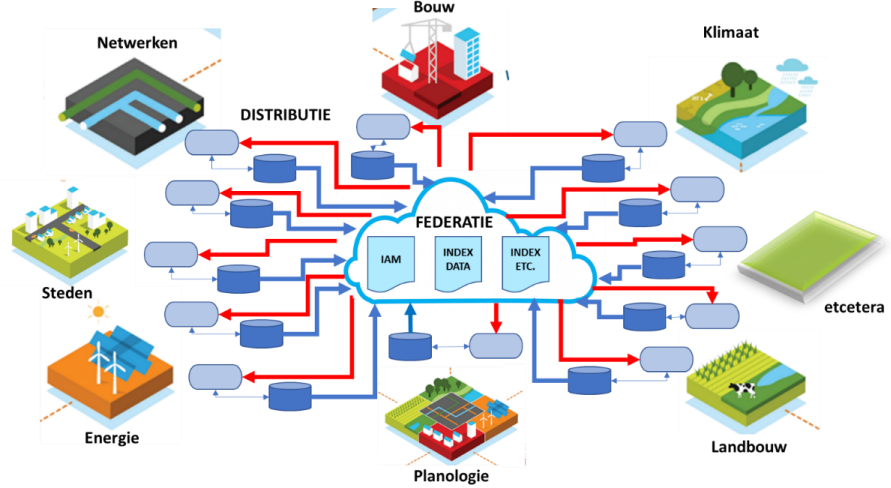

# Behoefte
Er is behoefte aan samenhangende gegevens vanuit verschillende hoeken. Dit hoofdstuk geeft hiervan een overzicht.

## DiSGeo

In de hoofdlijnen van de inhoud van de samenhangende objectenregistratie zijn een aantal [algemene uitgangsunten](https://docs.geostandaarden.nl/disgeo/def-al-hiso-20200617/#algemene-uitgangspunten-samenhangende-objectenregistratie) geformuleerd. Het 2e uitgangspunt benadrukt het belang van semantische harmonie. 
Dit is vervolgens als [ontwerpprincipe](https://docs.geostandaarden.nl/disgeo/emso/#definiering) opgenomen in het document met eisen aan het model van de samenhangewnde objectenregistratie.

## Definities van zowel objecttypen als eigenschappen van objecttypen zijn scherp afgebakend, niet multi-interpretabel en sluiten waar mogelijk aan op bestaande definities ##

Het is van groot belang dat de basis van een informatiemodel voor een samenhangende objectenregistratie wordt gevormd door een aantal onderling goed afgestemde en heldere definities. In de bestaande basisregistraties is daarvan momenteel niet altijd sprake. Hierdoor wordt de onderlinge koppelbaarheid van gegevens beperkt en laat de uniformiteit van de opgenomen gegevens (door interpretatieverschillen of in de definities opgenomen vrijheidsgraden) nogal eens te wensen over. Bij de verdere uitwerking van de inhoud van een samenhangende objectenregistratie worden bestaande definities daarom zodanig uitgebreid en geharmoniseerd dat:

- een scherp afgebakende en duidelijke definitie van objecttypen en eigenschappen ontstaat;
- definities elkaar semantisch niet overlappen;
- er niet langer gebruik wordt gemaakt van verzamelclassificaties;
- een optimale aansluiting op overkoepelende modellen en sectorale modellen wordt gerealiseerd, zoals NEN 3610 (Basismodel Geo-informatie) en NEN 2660 (Ordeningsregels voor gegevens in de bouw - Termen, definities en algemene regels)

In de Samenhangende Objectenregistratie worden de geo-basisregistraties zodanig omgevormd dat ze voor een gebruiker als één semantisch geheel te beschouwen zijn.

<figure>
    
    <figcaption>Samenhangende objectenregistratie</figcaption>
</figure>

## UoI

Het Unieke Object Identificatie rapport beschrijft verschillende oplossingsrichtingen voor het kunnen combineren van gegevens:

<figure>
    
    <figcaption>Unieke Object Identificatie oplossingsrichtingen</figcaption>
</figure>

Met name de UOI varianten waarbij verwantschappen en/of relaties worden gelegd, sluiten aan bij het idee van semantische interoperabiliteit. 

<figure>
    
    <figcaption>UoI met object verwantschappen en relaties</figcaption>
</figure>

## Programma Werken aan Uitvoering

Kadaster is met Geonovum in gesprek om een rol te nemen in het werken aan *samenhangende semantiek* die nodig is voor het "data-fundament" van het Kadaster. 

[aanvullen; ik heb hier helaas alleen maar tekst van]

## Digitale tweelingen
In digitale tweelingen wordt data gecombineerd uit meestal zeer veel uiteenlopende bronnen. 

<figure>
    
    <figcaption>Referentiearchitectuur digital twinning</figcaption>
</figure>

## Tot slot
Kortom, er zijn veel toepassingen voor samenhangende geo-informatie. Vaak is er geen behoefte aan de data zoals die nu in silo's geregistreerd wordt en van daaruit ontsloten, maar aan geïntegreerde informatie op basis van verschillende bronnen. De basisregistraties zijn los van elkaar ontstaan en ontwikkeld. Nu de data er is wil men samenhang. Niet een stel registraties, maar een stelsel van registraties. 
