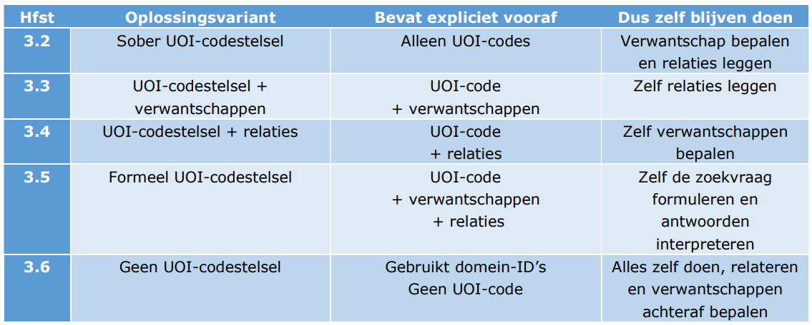

# Behoefte
Er is behoefte aan samenhangende gegevens vanuit verschillende hoeken. 

## DiS Geo

In de Samenhangende Objectenregistratie worden de geo-basisregistraties omgevormd tot één semantisch geheel: 

## UoI

Het Unieke Object Identificatie rapport beschrijft verschillende oplossingsrichtingen voor het kunnen combineren van gegevens:

Met name de UOI varianten waarbij verwantschappen en/of relaties worden gelegd, sluiten aan bij het idee van semantische interoperabiliteit. 

## Programma Werken aan Uitvoering

Kadaster is met Geonovum in gesprek om een rol te nemen in het werken aan *samenhangende semantiek* die nodig is voor het "data-fundament" van het Kadaster. 

[aanvullen; ik heb hier helaas alleen maar tekst van]

## Digitale tweelingen
In digitale tweelingen wordt data gecombineerd uit meestal zeer veel uiteenlopende bronnen. 

Kortom er zijn veel toepassingen voor geo-informatie. Vaak is er geen behoefte aan de data zoals die nu in silo's geregistreerd wordt en van daaruit ontsloten, maar aan geïntegreerde informatie op basis van verschillende bronnen. De basisregistraties zijn los van elkaar ontstaan en ontwikkeld. Nu de data er is wil men samenhang. Niet een stel registraties, maar een stelsel van registraties. 
