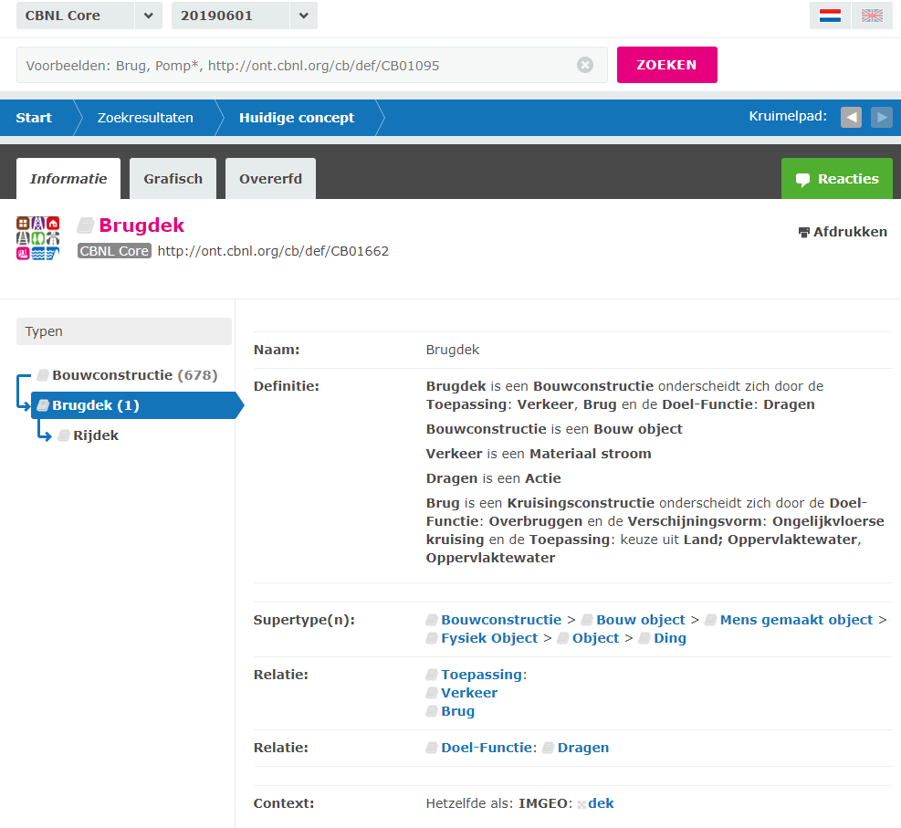
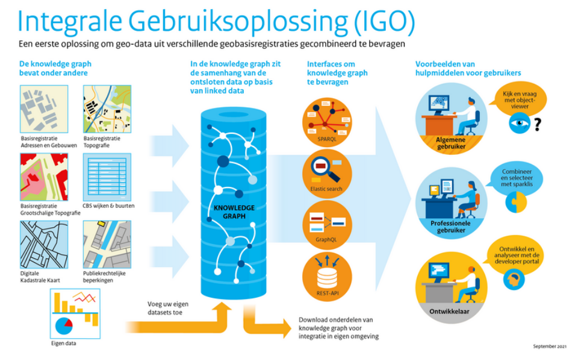

# Eerder werk
Geonovum heeft door de jaren heen al eerdere pogingen gedaan om aan semantische harmonisatie te werken. We kunnen het geleerde hiervan gebruiken en gemaakte fouten vermijden.

Een overzicht. 

## Conceptenbibliotheek
De [conceptenbibliotheek](https://definities.geostandaarden.nl) is ontstaan uit het idee om een harmonisatieslag te gaan doen op de raakvlakken tussen domeinmodellen. 

Stappen: 
- domeinmodellen verzameld (dat was al een lastige klus, uit dit inzicht is het technisch register ontstaan)
- alle begrippen uit deze modellen geëxtraheerd en grofweg in inhoudelijke categorieën ingedeeld
- workshops gehouden met domeinmodel-eigenaren om overlap te ontdekken
- significante raakvlakken dieper bestudeerd, onderzocht of er in de werkprocessen verbeteringen te doen zijn / integratie bij de bron, dubbel inwinnen tegengaan
- conceptenbibliotheek opgezet

Ons artikel [Towards a high level of semantic harmonisation in the geospatial domain](https://research.tudelft.nl/en/publications/towards-a-high-level-of-semantic-harmonisation-in-the-geospatial-/fingerprints/) geeft hiervan een overzicht. 

De conceptenbibliotheek is een *thesaurus*: een woordenboek waarbij de termen in hiërarchisch verband met elkaar zijn gebracht, aangevuld met relaties die uitdrukken dat termen synoniem zijn. 

We wilden in de conceptenbibliotheek de begrippen uit alle NEN 3610 sectormodellen opnemen *en ze aan elkaar gaan relateren*, om zo een overkoepelend begrippenkader voor het geo-domein te maken, op basis van bestaande domeinmodellen. Geonovum zou vervolgens de autoriteit worden over de relaties tussen begrippen (en dus tussen klassen in domeinmodellen). Een governance rol dus.

De conceptenbibliotheek is er wel gekomen, maar lang niet alle beheerders van sectormodellen hadden interesse om deel te nemen. De mogelijkheid om relaties te leggen tussen begrippen uit verschillende domeinen is er nooit gekomen. 

## CB-NL
Voor efficiëntere BIM-processen wordt de [CB-NL](https://public.cbnl.org) ontwikkeld, de Nederlandse Conceptenbibliotheek voor de gebouwde omgeving. De CB-NL (een initiatief van de BouwInformatieRaad (BIR)) wordt een digitale semantische bibliotheek: een verzameling van taaldefinities van objecten en ruimtes die uniformerend werken tussen bestaande standaarden, normen en object-/productbibliotheken. Deze bibliotheek wordt gratis toegankelijk via het internet. De CB-NL wordt de verbinder tussen bronnen, zoals die van RAW, STABU, NEN, IMGeo, ETIM en Rioned. Het is dus géén nieuwe producten- of objectenbibliotheek erbij, maar een intermediair tussen bestaande bibliotheken.

In de beginfase van de CB-NL - alweer zo'n 8 jaar geleden - heeft Geonovum meegewerkt aan het uitdenken van de achterliggende principes die beschreven zijn in de [modeling guide](https://wiki.cbnl.org/bin/view/3.+Modeling+Guide/WebHome/index.html). De CB-NL is, in tegenstelling tot de Geonovum conceptenbibliotheek, geen thesaurus maar een full-blown ontologie, waarbij betekenisvolle relaties tussen concepten bestaat en alle concepten formeel gedefinieerd zijn door deze relaties. 

<figure>
    
    <figcaption>De CBNL definitie van het concept <a href="http://ont.cbnl.org/cb/def/CB01662">Brugdek</figcaption>
</figure>

## Afstudeeronderzoek
TODO beschrijven afstudeeronderzoek van Gabriella [Towards the linking of geospatial government data](https://repository.tudelft.nl/islandora/object/uuid:f02e513c-bbb4-4b19-813b-4b5a062725d0?collection=education).

## DiSGeo: Eisen aan model samenhangende objectenregistratie
TODO beschrijven [EMSO](https://docs.geostandaarden.nl/disgeo/emso/)

## DiSGeo Architectuur
In de architectuur van DisGeo wordt het belang van semantische interoperabilitiet ook benadrukt. Bij de [niet-functionele eisen](https://docs.geostandaarden.nl/disgeo/arch/#niet-functionele-eisen) wordt aangegeven dat de eisen aan compatibiliteit onder andere de interoperabiliteit betreffen. Deze zijn zodanig dat gangbare technologie wordt toegepast waarmee een grote mate van technische interoperabiliteit wordt bereikt. Tegelijk maken de eisen aan interoperabiliteit van ICT-componenten en services mogelijk dat op niveau van de gegevens ook semantische interoperabiliteit wordt ondersteund. Beide niveaus van interoperabiliteit zijn noodzakelijk voor het bereiken van interoperabiliteit tussen organisaties, waardoor alle (overheids)organisaties met dezelfde basisgegevens kunnen werken.

## DiSGeo High 5 serie

In het kader van DisGeo zijn meerdere onderzoeken uitgevoerd waar ook de semantische harmonisatie aan de orde kwam. Een aantal relvante bevindingen worden hier nogmaals aangestipt:

### [DiSGeo High 5 2019](https://docs.geostandaarden.nl/disgeo/dll/)

In dit onderzoek had een van de hoofdconclusies betrekking op de [samenhang tussen objecten](https://docs.geostandaarden.nl/disgeo/dll/#samenhang-tussen-objecten)

Datasets zijn in de huidige praktijk meestal niet gekoppeld. Bijvoorbeeld bevatten veel registraties, in plaats van een BAG identifier, nog velden waar adressen als tekst zijn opgenomen. Deze adressen matchen niet 100% met de BAG.

Om de objectenregistraties in samenhang te kunnen bevragen, is het een basisvoorwaarde dat de datasets op het niveau van individuele objecten aan elkaar gekoppeld zijn met behulp van identifiers. Bij voorkeur zijn deze opgenomen in de vorm van URIs.

*Aanbeveling*: Regel de governance voor het eenmalig leggen en vervolgens beheren van deze links - dit kost tijd en geld.

*Aanbeveling*: Regel de governance over de semantiek van de verbindingen.

*Aanbeveling*: Leg afspraken over het vormen en beheren van URIs vast in een landelijke URI strategie of bredere linked data strategie, gebaseerd op de [NLURIStrategie] die hier al een aanzet voor biedt.

*Aanbeveling*: Laat APIs verplicht verwijzen naar identifiers uit de samenhangende objectenregistratie als die relaties er zijn. Laat in Linked Data in die gevallen de URIs uit de samenhangende objectenregistratie opnemen.

Daarnaast wer der nog een [overweging voor vervolg](https://docs.geostandaarden.nl/disgeo/dll/#overweging-voor-vervolg) gegeven.
De semantische relaties van de samenhangende objectenregistratie (opvolger van de stelselcatalogus, in ieder geval voor de geo-basisregistraties) moeten altijd gerelateerd zijn aan het semantische model van de datasets. Dit is een relatief eenvoudig te zetten stap die helpt om de orchestratielaag compact en beheersbaar te houden.

### [DiSGeo High 5 2020](https://docs.geostandaarden.nl/disgeo/dll2/)
In dit onderzoek wat een follow-up was van het voornoemde onderzoek, werd wederom geconstateerd dat het aan governance op de koppelvlakken ontbrak bj de use cases die gebruikt werden. Door verschil in definities was er bijvoorbeeld kans op mis-interpretaties.

### [DiSGeo High 5 2021](https://docs.geostandaarden.nl/disgeo/def-al-dll3a-20220211/)
Dit onderzoek had het doel te beproeven of het mogelijk is de basisregistraties in samenhang te bevragen, waarbij deze samenhang nog niet in de data (in de vorm van relaties tussen instanties) aanwezig is, en zonder de onderliggende registraties of de data die daarin staan aan te passen. De samenhang wordt gerealiseerd door een samenhangende, integrale semantische laag die ervoor zorgt dat vragen over registraties heen kunnen worden gesteld en beantwoord. 
Er werd daarbij een [aanbeveling tot koppelen](https://docs.geostandaarden.nl/disgeo/def-al-dll3a-20220211/#aanbevelingen-met-betrekking-tot-koppelen) gedaan, waarbij aangegeven werd dat het voor afnemers van belang is dat gegevens en modellering er hetzelfde uitziet, zodat afnemers het geheel ook ervaren als een samenhangend stelsel. Dit wordt voor de samenhangende objectenregistratie gestandaardiseerd, maar voor andere bronnen nog niet.

## IGO
Er is in 2021 een eerste eenvoudige oplossing (MVP)door het Kadaster ontwikkeld voor
integraal gebruik van de GEO basisregistraties, maar ook als voorproefje van de komende
‘Objectenregistratie’ (SOR), een [integrale gebruiksoplossing](https://labs.kadaster.nl/cases/integralegebruiksoplossing)  vanwege het feit dat gebruikers steeds vaker en steeds meer behoefte hebben aan integraal
gebruik van data uit verschillende basisregistraties. Dat blijkt uit alle onderzoeken,
gebruikersoverleggen en dagelijkse contacten die men met gebruikers heeft. 
Het Stelsel van basisregistraties is daar echter niet op ingericht, want data zitten verankerd
in de specifieke registraties. Die ieder voor zich en op een andere manier
bruikbaar zijn. M.a.w. niet de data, maar de registraties staan centraal.
Omdat overheden voor veel processen toch integrale data nodig hebben,
hebben ze oplossingen gebouwd voor specifiek integraal gebruik.
Maar er zijn niet of nauwelijks oplossingen bebouwd voor generiek integraal
gebruik.

<figure>
    
    <figcaption>Integrale Gebruiks Oplossing</figcaption>
</figure>