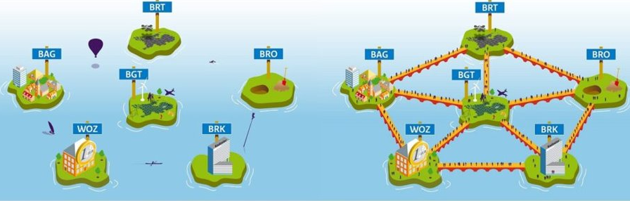
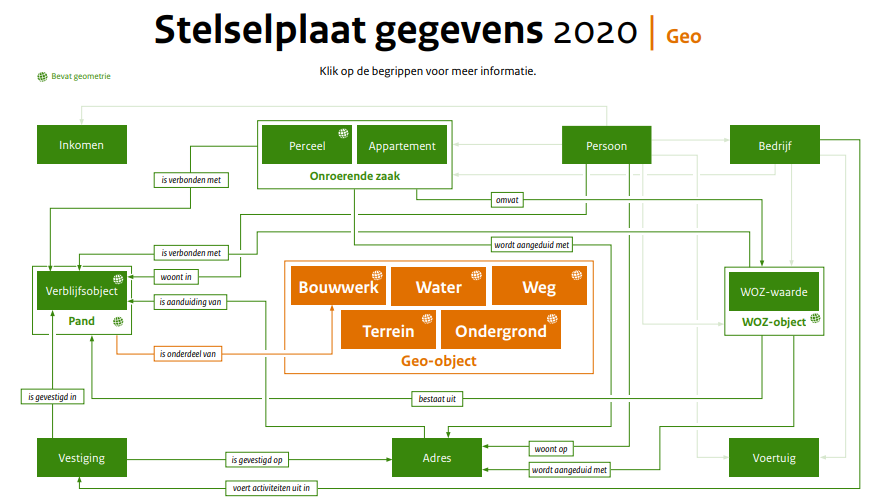

# Introductie

De aanleiding voor het schrijven van dit stuk is een brainstormsessie bij Geonovum over onze plannen voor de nabije toekomst. Onder andere wordt er geïnvesteerd in standaarden op het gebied van interactie: APIs. Dit is weliswaar belangrijk, maar we moeten een ander aspect niet uit het oog verliezen: semantiek en samenhang van de gegevens die we uitwisselen.

Het belang van semantische samenhang wordt goed geïllustreerd in een nieuwe architectuurschets die momenteel bij Geonovum ontwikkeld wordt. Deze schets is nog in wording, maar geeft een inkijkje in de drielaagse architectuur van de nieuwe NGII: 

<figure>
    
    <figcaption>Architectuurschets, conceptversie 1.2, Jan van Gelder - Geonovum</figcaption>
</figure>

Informatiemodellen spelen nog steeds een rol van betekenis in deze nieuwe architectuur. Deze plaat laat zien dat er informatiemodellen, in enige vorm, nodig zijn op alle drie de niveau's van de architectuur:
- In de onderste laag, het System of Records (SoR), zijn dit de domeininformatiemodellen / sectormodellen zoals we die kennen: IMBAG, IMGeo, IMRO, etc. 
- In de bovenste laag, het System of Engagement (SoE), zijn dit informatiemodellen die *informatieproducten* beschrijven. 
- In de middelste laag, het System of Integration (SoI), **is een informatiemodel nodig dat de samenhang van de domeinmodellen beschrijft**.

Over deze laatste wil ik het in dit document hebben. 

## Semantische interoperabiliteit

De laatste jaren is het besef ontstaan dat in Nederland de basisregistraties dan wel zijn gerealiseerd en op orde zijn; maar dat gebruikers dit ervaren als een *stel* basisregistraties, niet als een *stelsel*!

<figure>
    
    <figcaption>Van geobasisregistraties op eilanden naar een samenhangend beeld</figcaption>
</figure>

Bij *samenhang* denken we aan semantische interoperabiliteit. Daarmee bedoelen we: 

*Als domeinmodellen semantisch interoperabel zijn, is het mogelijk de gegevens die in deze informatiemodellen beschreven worden, met elkaar te combineren omdat de betekenis van de gegevens helder is, ook ten opzichte van gegevens in andere informatiemodellen; en omdat de gegevens van verschillende informatiemodellen daar waar er raakvlakken zijn, op elkaar afgestemd zijn en de relatie tussen de gegevens helder is.* 

Met andere woorden, we willen niet dat de domeinmodellen los van elkaar staan, maar willen dat ze onderling verbonden zijn. In werkelijkheid is het immers zo dat er allerlei raakvlakken zijn tussen de domeinmodellen. Bovendien zijn er ook raakvlakken tussen de geodomeinmodellen en allerlei informatie van buiten het geodomein, bijvoorbeeld met informatie uit de bouwsector. 

Je kunt op een tekening wel een lijntje trekken tussen BAG en WOZ, maar wat betekent dit dan concreet? Als we inzoomen  zien we dat er lijntjes - raakvlakken - zijn tussen allerlei *objecttypen* uit beide informatiemodellen. Dáár gaat het om. 

Stel je daarbij zoiets voor: 

<figure>
    
    <figcaption>Stelselplaat Gegevens | Geo. 30 maart 2020 (<a href="https://www.digitaleoverheid.nl/document/stelselplaat-gegevens-geo/">Bron</a></figcaption>
</figure>

Deze semantische interoperabiliteit is nodig, omdat in het System of Engagement informatieproducten worden gemaakt, waarin data uit verschillende domeinen worden gecombineerd tot informatie. En uiteindelijk dus omdat steeds meer toepassingen informatie nodig hebben, die ontstaat uit geïntegreerde gegevens. Gebruikers hebben daarbij behoefte aan een gemeenschappelijke feitenbasis - een eenduidig beeld, zonder inconsistenties en met samenhang.

## Geometrie
Dit integreren is lang niet altijd mogelijk op basis van de geometrie. Waarom niet? 
- Lang niet elke gebruiker heeft de kennis of mogelijkheden om gegevens zelf te integreren met gebruik van een GIS
- Het integreren van gegevens met een verschillende herkomst op basis van de geometrie kent een hoge mate van onzekerheid door verschillen in definitie, afbakening, schaal, inwinning, etc.
- Niet alle gegevens die men wil integreren, bevat een geometrie. Dit kan ook een niet-geometrische locatieaanduiding zijn of een ander aanknopingspunt.

Kortom, definities (i.e. semantiek) en relaties (i.e. samenhang) zijn nodig om semantische interoperabiliteit te bereiken. 