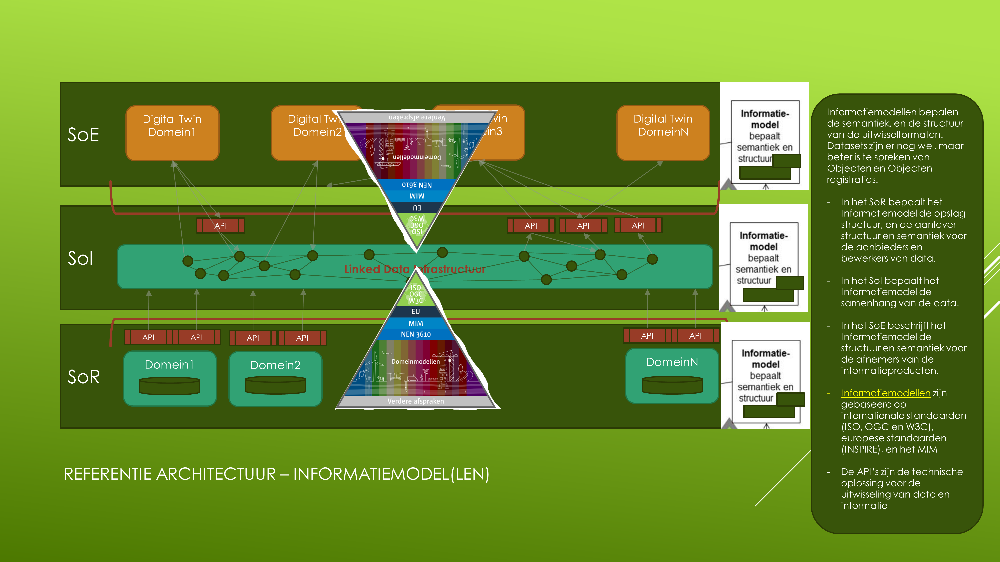
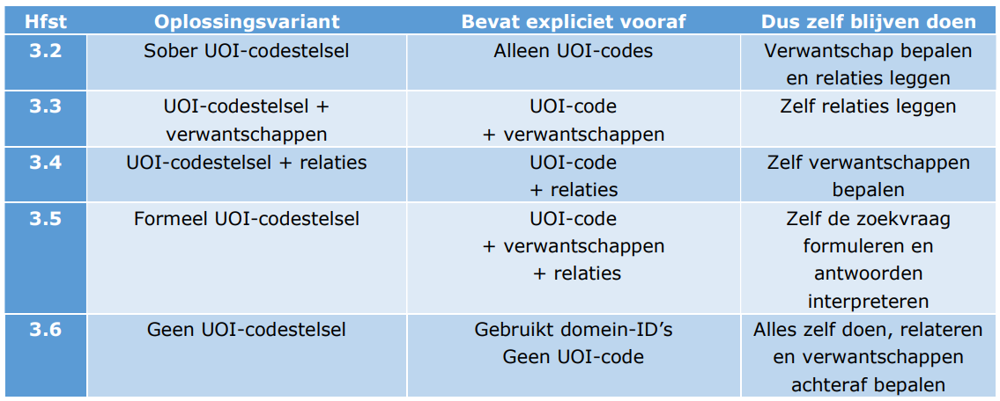
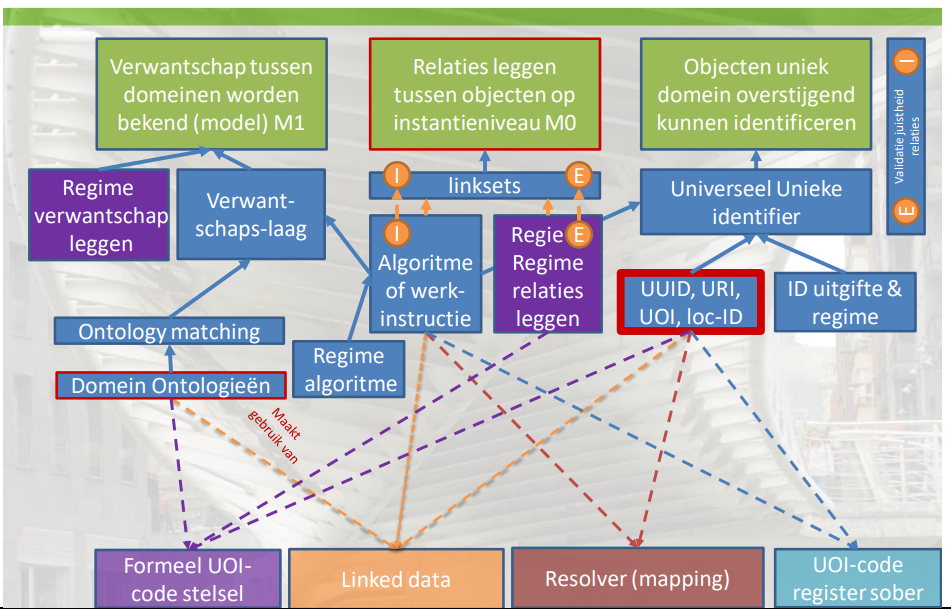
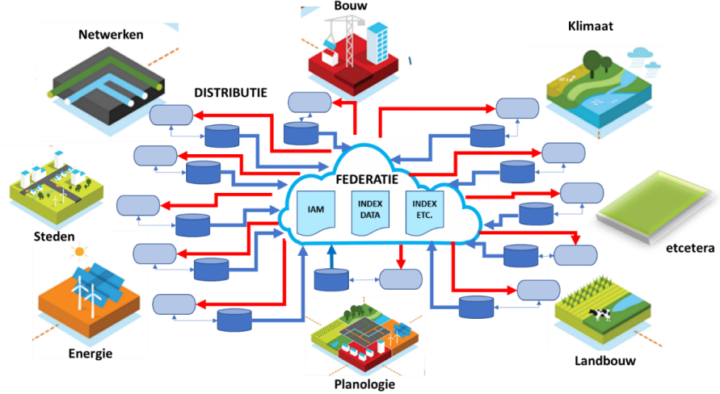

# Introductie

Geonovum is aan het nadenken over de architectuur van de nieuwe NGII: 

Deze plaat laat zien dat er informatiemodellen, in enige vorm, nodig zijn op alledrie de niveau's van de architectuur. 
- In de System of Records (SoR) laag zijn dit de domeininformatiemodellen / sectormodellen zoals we die kennen: IMBAG, IMGeo, IMRO, etc. 
- In de System of Engagement (SoE) laag zijn dit informatiemodellen die *informatieproducten* beschrijven. 
- In de System of Integration (SoI) laag **is een informatiemodel nodig dat de samenhang van de domeinmodellen beschrijft**

Over deze laatste wil ik het in dit document hebben. 

## Semantische interoperabiliteit
Bij de kreet 'samenhang van domeinmodellen' denk ik aan "semantische interoperabiliteit". Daarmee bedoel ik: 

*Het is nodig om de relaties tussen de elementen uit domeinmodellen vast te leggen* 

Het is moeilijk om dit goed te verwoorden zonder in technische of anderzins lastige termen te vervallen, daarom een aantal voorbeelden: 
- Het BAG Pand heeft een relatie met het BGT Pand. Namelijk: het gaat om *hetzelfde pand*, waarvan in beide modellen verschillende eigenschappen worden vastgelegd. 
- [kan ook een afbeelding worden met voorbeelden]

Waarom is deze semantische interop nodig? Omdat in het System of Engagement informatieproducten worden gemaakt, waarin data uit verschillende domeinen worden gecombineerd tot informatie. 

En waarom worden die informatieproducten gemaakt? Omdat gebruikers samenhangende informatie willen, geen gefragmenteerde data. 

## Behoefte
Er is behoefte aan semantische interop vanuit verschillende hoeken. 

### DiS Geo:

In de Samenhangende Objectenregistratie worden de geo-basisregistraties omgevormd tot één semantisch geheel: 

### UoI: 

Het Unieke Object Identificatie rapport beschrijft verschillende oplossingsrichtingen voor het kunnen combineren van gegevens:

Met name de UOI varianten waarbij verwantschappen en/of relaties worden gelegd, sluiten aan bij het idee van semantische interoperabiliteit. 

### Programma Werken aan Uitvoering: 

Kadaster is met Geonovum in gesprek om een rol te nemen in het werken aan *samenhangende semantiek* die nodig is voor het "data-fundament" van het Kadaster. 

[ik heb hier helaas alleen maar tekst van]

### Digitale tweelingen

In digitale tweelingen wordt data gecombineerd uit meestal zeer veel uiteenlopende bronnen. 

Kortom er zijn veel toepassingen voor geo-informatie. Vaak is er geen behoefte aan de data zoals die nu in silo's geregistreerd wordt en van daaruit ontsloten, maar aan geïntegreerde informatie op basis van verschillende bronnen. De basisregistraties zijn los van elkaar ontstaan en ontwikkeld. Nu de data er is wil men samenhang. Niet een stel registraties, maar een stelsel van registraties. 

## Hoe en wat
Wat zou semantische harmonisatie concreet moeten betekenen, wat doen we dan? 

Denkrichtingen: 
- Er zou een begrippenkader moeten komen met algemene, verbindende termen. 
- Geonovum zou de governance moeten doen van een semantisch samenhangend kader, dat wil zeggen toezicht op de semantiek en de raakvlakken tussen domeinmodellen.
- ...

Stel dat we een geharmoniseerd begrippenkader willen maken: wat zou Geonovum dan moeten doen om iets van de grond te krijgen? 
 - Optie 1: gewoon gaan doen; semantisch samenhangend begrippenkader maken en dan reacties vragen. Bijvoorbeeld 2 domeinen op elkaar aansluiten, daarover publiceren presenteren, dan kijken wie nog meer wil. 
 - Optie 2: eerst werkveld enthousiasmeren zodat behoefte ontstaat, dan met een community het geo-begrippenkader gaan definiëren.

## Valkuilen
Mogelijke valkuilen zijn: 
- Proberen een 'model van alles' te maken: deze pogingen stranden vaak. 
- [ik had er nog minstens eentje in m'n hoofd, nu even vergeten]

## Eerder werk
Geonovum heeft door de jaren heen al eerdere pogingen gedaan om aan semantische harmonisatie te werken. 

Een overzicht. 

### Conceptenbibliotheek
De [conceptenbibliotheek](https://definities.geostandaarden.nl) is ontstaan uit het idee om een harmonisatieslag te gaan doen op de raakvlakken tussen domeinmodellen. 

Stappen: 
- domeinmodellen verzameld (dat was al een lastige klus, uit dit inzicht is het technisch register ontstaan)
- alle begrippen uit deze modellen geëxtraheerd en grofweg in inhoudelijke categorieën ingedeeld
- workshops gehouden met domeinmodel-eigenaren om overlap te ontdekken
- significante raakvlakken dieper bestudeerd, onderzocht of er in de werkprocessen verbeteringen te doen zijn / integratie bij de bron, dubbel inwinnen tegengaan
- conceptenbibliotheek opgezet

Mijn [artikel] geeft hiervan een overzicht. (ref toevoegen)

We wilden in de conceptenbibliotheek de begrippen uit alle NEN 3610 sectormodellen opnemen *en ze aan elkaar gaan relateren*, om zo een overkoepelend begrippenkader voor het geo-domein te maken, op basis van bestaande domeinmodellen. Geonovum zou vervolgens de autoriteit worden over de relaties tussen begrippen (en dus tussen klassen in domeinmodellen). Een governance rol dus.

De conceptenbibliotheek is er wel gekomen, maar lang niet alle beheerders van sectormodellen hadden interesse om deel te nemen. De mogelijkheid om relaties te leggen tussen begrippen uit verschillende domeinen is er nooit gekomen. 

### Andere projecten
Overzicht aanvullen: 
- CB-NL
- afstudeeronderzoek van Gabriella
- DiS-Geo EMSO
- DiS-Geo High 5 met Kadaster data science team
- IGO